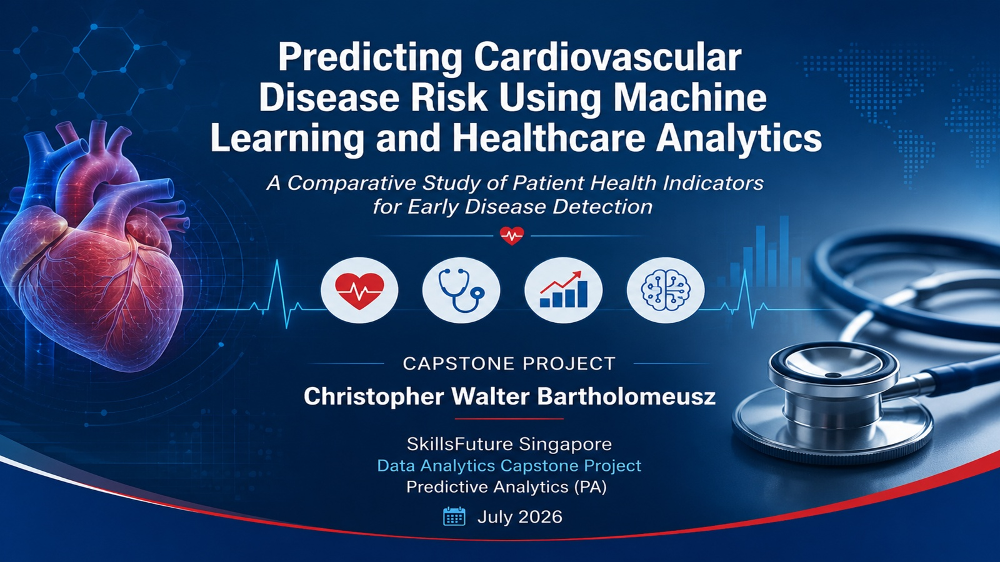

# Predicting Cardiovascular Disease Risk


## Overview
This project applies healthcare analytics and machine learning to predict cardiovascular disease risk using clinical patient data.

## Overview

This project demonstrates an end-to-end healthcare analytics workflow to predict cardiovascular disease risk using clinical patient data. The project integrates Excel Power Query, SQL, Python, feature engineering, and machine learning to develop and evaluate predictive models for early disease detection.

---

## Technologies

- Excel Power Query
- SQL
- Python
- Jupyter Notebook
- Machine Learning

---

## Workflow

1. Data extraction and preparation
2. Data cleaning and preprocessing
3. Exploratory Data Analysis (EDA)
4. Feature engineering
5. Machine learning model development
6. Model evaluation
7. Business insights and recommendations

---

## Project Highlights

- End-to-end healthcare analytics workflow
- Data transformation using Excel Power Query
- SQL database creation and querying
- Exploratory Data Analysis (EDA)
- Feature engineering
- Predictive modeling using machine learning
- Model evaluation and comparison
- Business recommendations for healthcare decision-making

---

## Results

### Model Performance Comparison

| Model | Accuracy | Precision | Recall | F1-Score | ROC-AUC |
|-------|---------:|----------:|-------:|---------:|--------:|
| **Logistic Regression** | **72.98%** | **76.31%** | 66.51% | **71.07%** | **0.791** |
| Random Forest | 71.05% | 71.84% | **69.07%** | 70.43% | 0.771 |
| Decision Tree | 63.68% | 63.70% | 63.30% | 63.50% | 0.637 |

### Key Findings

- Logistic Regression achieved the highest overall predictive performance.
- Random Forest achieved the highest recall, identifying more cardiovascular disease cases.
- Decision Tree produced the lowest predictive performance across all evaluation metrics.

### Final Recommendation

Logistic Regression was selected as the final predictive model because it achieved the strongest balance of predictive accuracy, precision, F1-score, ROC-AUC, and model interpretability.

---

## Repository Structure

```
Data/
SQL/
Python/
Presentation/
Report/
README.md
```

---

## Author

**Christopher Walter Bartholomeusz**

SkillsFuture Singapore – Data Analytics Capstone Project (Predictive Analytics)
